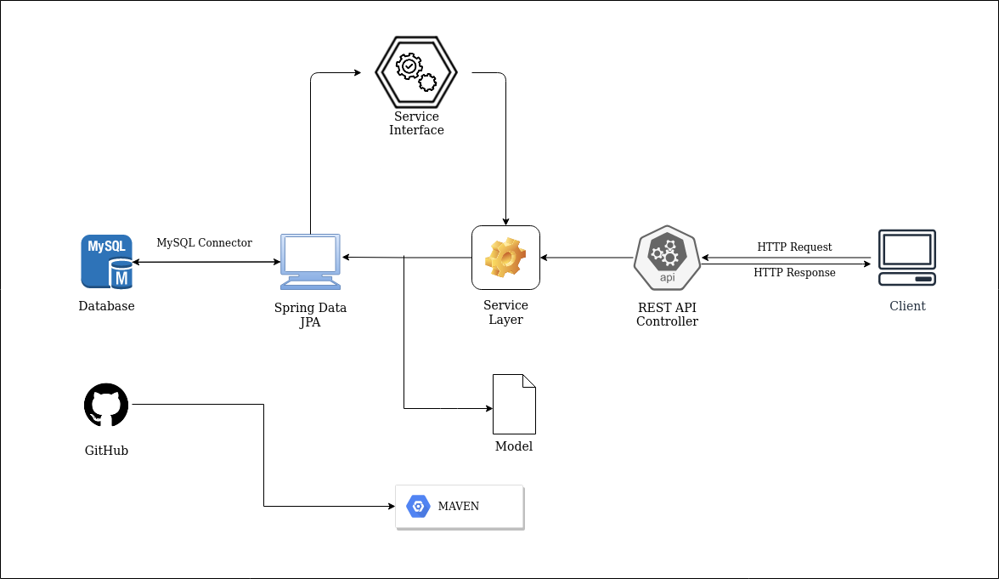
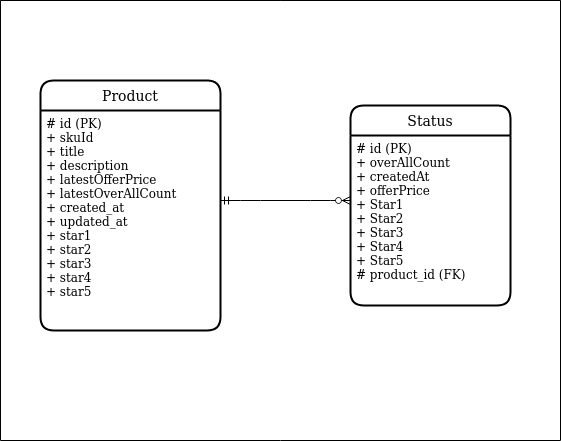

# Amazon Crawler and Extractor

## Description
    This Crawler and Extractor service takes an input amazon URL or SKU (Unique Identifier of product) and crawls that page to extract some attributes. It has features to show product details, price trends and all the products crawled upto a particular time (timestamp) as well.

---

## Setup
* Prerequisite - Java and MySQL    

    1. To Install Java: [Java Installation Guide ](https://java.com/en/download/help/download_options.html "Java Installation Guide")

    2. To Install MySQL: [MySQL Installation Guide](https://dev.mysql.com/doc/index-cluster.html "MySQL Setup")

            MySQL Setup in Linux (Ubuntu/Debian Based) System:

            sudo apt update
            sudo apt install mysql-server 
            sudo mysql_secure_installation

            # Now Follow Instructions on Terminal

            # To Create New User:

            sudo mysql
            CREATE USER username@'localhost' IDENTIFIED BY 'password';
            GRANT ALL PRIVILEGES ON *. * TO user_name@'localhost';


    3. Login using the **Username** and **Password** created while setting up the MySQL and then create a new database named **product** 
    <br>
        > The username and password are the ones which we created while installing MySQL in Step 2

            mysql -u username –p
            create database product;
            use product;
<br>

* Clone this Repository

* Replace the MySQL credentials **Username** and **Password** in **application.properties** file of the project inside the resources

* To run the Application:

    1. Go to the root directory of the project and type the following command in the terminal:

            mvn install

            mvn spring-boot:run
    
    **The server will run on port 8080**

---

## System Design
<br>



<br>

---

## Database Schema
<br>

* **Table 1: products**

    - This table will contain only one entry for any particular SKUID

    - It will contain most recent crawled information about the product containing the attributes like latestOfferPrice, title, description, RatingsMap, update time, creation time.

    - This table will be used to find out whether a product has been crawled before or not.

* **Table 2: status**

    - This table will contain information about the product, like price,ratingmap every time the product has been crawled.

    - With the help of this table we can easily filter out the product information, based upon their SKUID and the timestamp before which we need the information

    - product_id column is the foreign key refrencing to primary key of **products** table 

    **There is many to one relation between **product** table and **status** table**

<br>
<p align="center">
  
</p>
<br>

---
<br>

## POSTMAN API DOCUMENTAION & COLLECTION
- [POSTMAN API DOCUMENTATION](https://documenter.getpostman.com/view/10130647/TzY4hG9x "API Documentation")

- [POSTMAN API COLLECTIONS](https://www.postman.com/collections/a9f6344b5ac2d02bd280 "API Collections")

<br>

---
<br>

## Features
- This service can fetch product details using URL or SKUID

- Using random user agent to avoid IP blocking or bot detection from Amazon while crawling

- Fetches Price Trend for any product

- Response time is present in the logs

- Scheduled crawling in status table

<br>

---

## API ENDPOINTS
#### ( Read Documentation for better Understanding )

<br>

### 1. GET HTML ( /gethtml )
#### Request :
```
curl --location --request GET 'http://localhost:8080/gethtml?skuId=B07XMLWH7J'
```
#### Response :
```
{
    displayMessge:	"Successfully!! Fetched H… the given URL or SKUID"
    htmlDocument:	"<!doctype html>\n<html l… --> \n </body>\n</html>"
}
```
<br>

### 2. GET Product Details ( /getProductDetails )
#### Request :
```
curl --location --request GET 'http://localhost:8080/getProductDetails?skuId=B07XMLWH7J'
```
#### Response :
```
{
    "displayMessge": "Successfully!! Fetched Product Details",
    "title": "Kellogg's Corn Flakes Original, High in Iron, High in B Group Vitamins, Breakfast Cereals, 1.2 kg Pack",
    "offerPrice": "? 348.00",
    "description": "Don't compromise on morning nourishment when you have a balanced, great-tasting breakfast that is high in iron, vitamin b1, b2, b3, b6 and vitamin c, it is quick to eat and gives you energy even after 3 hours.",
    "ratingsMap": {
        "totalCount": "12,137 ratings",
        "5 Star": "67%",
        "4 Star": "24%",
        "3 Star": "6%",
        "2 Star": "1%",
        "1 Star": "2%"
    }
}
```
<br>

### 3. GET ALL Products ( /getAllProducts)
#### Request :
```
curl --location --request GET 'http://localhost:8080/getAllProducts'
```
#### Response :
```
{
    "displayMessge": "Successfully!! Fetched Product Details",
    "getProdDetailResponseList": [
        {
            "title": "AmazonBasics Padded Pet Bolster Bed - 89 x 56 cm",
            "offerPrice": "? 562.00",
            "description": "Padded pet bolster bed - 89 x 56 cm",
            "ratingsMap": {
                "totalCount": "985 ratings",
                "5 Star": "68%",
                "4 Star": "16%",
                "3 Star": "9%",
                "2 Star": "3%",
                "1 Star": "4%"
            }
        },
        {
            "title": "Kellogg's Corn Flakes Original, High in Iron, High in B Group Vitamins, Breakfast Cereals, 1.2 kg Pack",
            "offerPrice": "? 348.00",
            "description": "Don't compromise on morning nourishment when you have a balanced, great-tasting breakfast that is high in iron, vitamin b1, b2, b3, b6 and vitamin c, it is quick to eat and gives you energy even after 3 hours.",
            "ratingsMap": {
                "totalCount": "12,137 ratings",
                "5 Star": "67%",
                "4 Star": "24%",
                "3 Star": "6%",
                "2 Star": "1%",
                "1 Star": "2%"
            }
        },
        {
            "title": "Portronics Pure Sound Pro III POR-891, Bluetooth 4.2 an All-in-One Versatile Wireless SOUNDBAR with FM Tuner, 3.5mm AUX, Powerful 10W Sound and USB Port.",
            "offerPrice": "? 1,799.00",
            "ratingsMap": {
                "totalCount": "1,962 ratings",
                "5 Star": "52%",
                "4 Star": "26%",
                "3 Star": "9%",
                "2 Star": "4%",
                "1 Star": "9%"
            }
        },
        {
            "title": "HP 15 (2021) Thin & Light Ryzen 3-3250 Laptop, 8 GB RAM, 1TB HDD + 256GB SSD, 15\" (38.1 cms) FHD Screen, Windows 10, MS Office (15s-gr0012AU)",
            "offerPrice": "? 41,990.00",
            "description": "Stay connected to what matters most with long-lasting battery life and a thin, micro-edge bezel design. Built to keep you productive and entertained, the HP 15\" diagonal laptop features reliable performance and an expansive display - letting you stream, s",
            "ratingsMap": {
                "totalCount": "230 ratings",
                "5 Star": "54%",
                "4 Star": "31%",
                "3 Star": "7%",
                "2 Star": "2%",
                "1 Star": "7%"
            }
        },
        {
            "title": "Samsung Galaxy Watch Active 2 (Bluetooth, 44 mm) - Black, Aluminium Dial, Silicon Straps",
            "offerPrice": "? 19,648.00",
            "description": "The all-new Galaxy Watch Active2 now comes with a bigger customizable screen and fresh new look. It gives you precise health insights when you need it, while keeping you fully connected. The Galaxy Watch Active2 is super customizable from day one. Choose ",
            "ratingsMap": {
                "totalCount": "1,543 ratings",
                "5 Star": "69%",
                "4 Star": "18%",
                "3 Star": "5%",
                "2 Star": "2%",
                "1 Star": "6%"
            }
        }
    ]
}
```
<br>

### 4. GET Product Details Crawled Before Timestamp (/getProductDetailsBT )
#### Request :
```
curl --location --request GET 'http://localhost:8080/getProductDetailsBT?skuId=B07XMLWH7J&timestamp=2021-06-06 20:00:00.0'
```
#### Response :
```
{
    "displayMessge": "Successfully!! Fetched Product Details",
    "title": "Kellogg's Corn Flakes Original, High in Iron, High in B Group Vitamins, Breakfast Cereals, 1.2 kg Pack",
    "offerPrice": "? 330.00",
    "description": "Don't compromise on morning nourishment when you have a balanced, great-tasting breakfast that is high in iron, vitamin b1, b2, b3, b6 and vitamin c, it is quick to eat and gives you energy even after 3 hours.",
    "ratingsMap": {
        "totalCount": "12,028 ratings",
        "5 Star": "66%",
        "4 Star": "24%",
        "3 Star": "6%",
        "2 Star": "1%",
        "1 Star": "2%"
    }
}
```
<br>

### 5. GET Price Trend Using SKUID(/getPriceTrend )
#### Request :
```
curl --location --request GET 'http://localhost:8080/getPriceTrend?skuId=B07XMLWH7J'
```
#### Response :
```
{
    "displayMessge": "Successfully!! Fetched Product Details",
    "prices": [
        {
            "timestamp": "2021-06-06 16:37:20.0",
            "price": "? 330.00"
        },
        {
            "timestamp": "2021-06-06 20:57:55.0",
            "price": "? 348.00"
        },
        {
            "timestamp": "2021-06-06 20:58:26.0",
            "price": "? 348.00"
        },
        {
            "timestamp": "2021-06-06 21:09:57.0",
            "price": "? 348.00"
        }
    ]
}
```

<br>

---